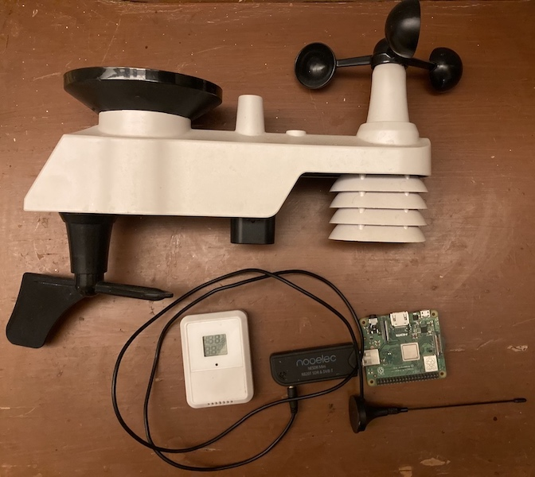

# Raspberry Pi Weather Station

This repository is for recording and visualizing data from a Switchdoc Labs WeatherSense weather station, which includes two sensor units:
- FT020T (outdoor) sensor, which includes Temperature, Humidity, Windspeed, Rainfall, and Sunlight
- F016TH (indoor) sensor, for Temperature and Humidity

The sensors transmit in the ISM radio band, so a radio receiver is required (in this case, a USB module + antenna) attached to a Raspberry Pi.



The code in this repository starts 3 services, responsible for:
1) Listening for radio transmissions (and deduplicating)
2) Logging the received data to an InfluxDB database;
3) Running a Grafana dashboard
4) Serving with Nginx


### 1) SDR Weather Reading service

This service relies on the `rtl_433` package, which is responsible for processing the incoming radio transmissions and formatting them into JSON. This will be downloaded and built by the `install.sh` script. If necessary to configure,
*rtl_433* will search for configs in these locations:
- rtl_433.conf
- /home/pi/.config/rtl_433/rtl_433.conf
- /usr/local/etc/rtl_433/rtl_433.conf
- /etc/rtl_433/rtl_433.conf

The Python `start.py` script uses rtl_433 to check the radio reading, then inserts that data into the database. (The database name is set in `config.py`). To get this code to run on boot, edit the `sdr_weather_reading.service` file to specify the location of the `start.py` script. Then, move (or copy) the service file into */etc/systemd/system/*, and run commands to enable it as a service:

```
sudo chmod 644 /etc/systemd/system/<name>.service
sudo systemctl daemon-reload
sudo systemctl enable <name>.service
```


### 2) InfluxDB Service

This service runs the time-series database InfluxDB on the Raspberry Pi. As of Jan 2022, version 1.6 will be installed _not_ v2.x, which is substantially different. To run this service (after installing influxDB), the install script runs:
```
sudo systemctl unmask influxdb
sudo systemctl enable influxdb
sudo systemctl start influxdb
```
You can check that it's running correctly with `systemctl status influxdb.service`. Note that the database named in `config.py` must be manually created for data to be logged correctly.


### 3) Grafana Service

The Grafana service runs a dashboard connected to the above InfluxDB. Grafana does not appear to be available in the standard Raspbian sources, so a new entry is added to `sources.list.d` (check `linux_install.sh`). The install script runs *unmask*, *enable*, and *start* on the service (as with InfluxDB). To check the status, this service is called `grafana-server.service`

Grafana can be configured within the UI itself. If you forget your password (default is _admin_) you can reset with `grafana-cli admin reset-admin-password <new password>`.

### 4) Nginx Service

Grafana will run on port 3000 by default. You could probably change it, but I think it makes more sense to run nginx, and have it proxy requests. Like other services, install/unmask/enable/start as necessary. The simplest-possible config is in `nginx.conf`, which should be placed in `/etc/nginx`.

With the service (and grafana running), entering the IP of your Raspberry Pi into the browser will display the Grafana dashboard.

#### Install

run the script `linux_install.sh` to install all dependencies. SwitchdocLabs rtl_433 will be pulled from github, and other dependencies installed, including:
- InfluxDB installed and service created (note that as of Jan 2022 version 1.6 will be installed _not_ v2.x)
- Grafana installed and service created

*rtl_433* will search for configs in these locations:
- rtl_433.conf
- /home/pi/.config/rtl_433/rtl_433.conf
- /usr/local/etc/rtl_433/rtl_433.conf
- /etc/rtl_433/rtl_433.conf
